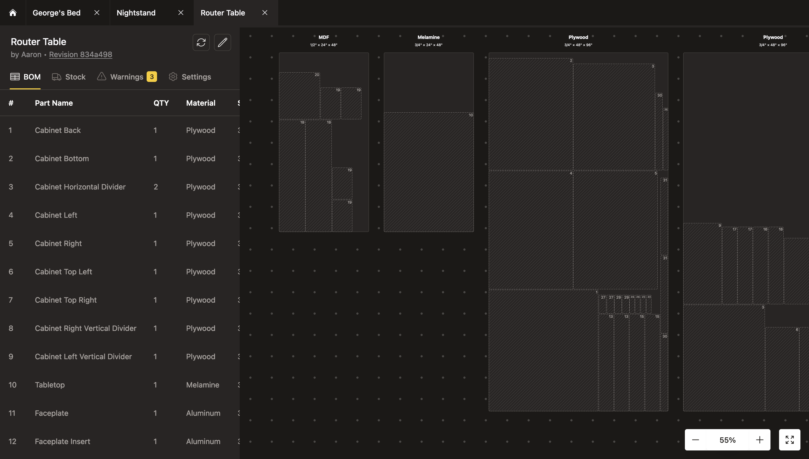

# @aklinker1/cutlist

Website and NPM tool for generating cutlists for an onshape assembly.



> [!WARNING]
> NPM package is not published yet. Might not publish it.

## Usage

This tool only works for assemblies on the main workspace.

1. Enter assembly's URL into the URL input
2. In onshape, assign materials to all your parts
3. Add boards to your project, using the material names you just selected
4. Go buy the boards you need and use the layouts to make your cuts!

## Development

To install dependencies:

```bash
bun install
```

To start the website in dev mode, copy `.env.example` and fill out values from an API key [here](https://dev-portal.onshape.com/keys) (create one if none exist), then run:

```sh
bun dev
```

To publish docker image:

```bash
bun publish:web:docker
```
